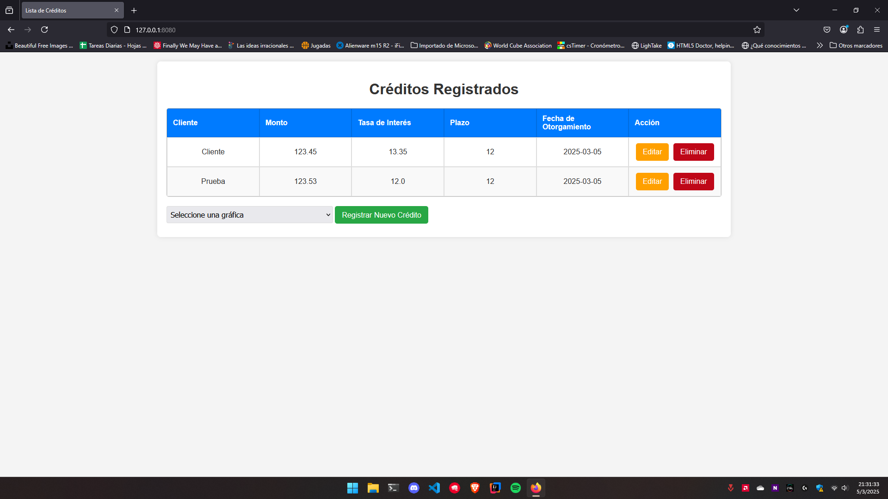
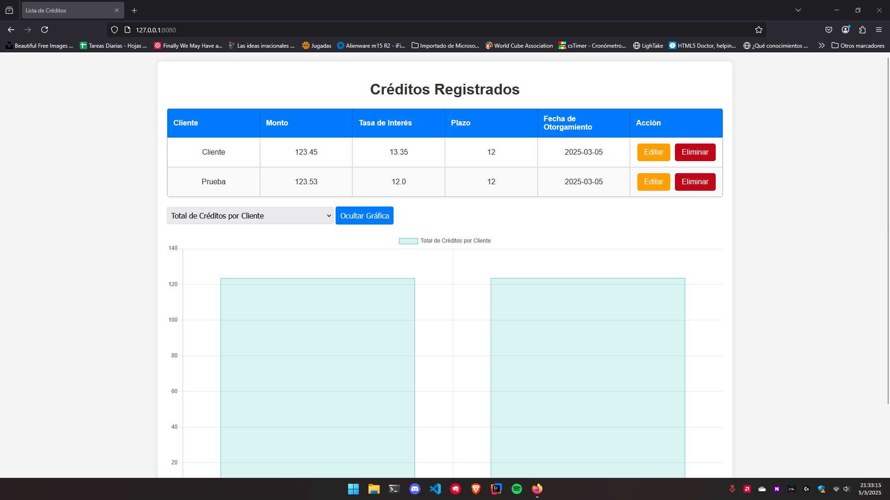

# Herramienta de Registro de Créditos

Este proyecto es una herramienta web desarrollada en **Python** con **Flask** y **SQLite** que permite registrar, editar, eliminar y visualizar créditos otorgados. Además, incluye gráficas interactivas para mostrar el total de créditos por cliente y su distribución por rangos de montos.

## Requisitos

Antes de ejecutar el proyecto, asegúrate de tener instalado Python 3.x. Se recomienda utilizar un entorno virtual para aislar las dependencias del proyecto. Sigue estos pasos:

1. Crea un entorno virtual:

```bash
python -m venv venv
```

2. Activa el entorno virtual:

- En Windows:
  ```bash
  venv\Scripts\activate
  ```

- En macOS/Linux:
  ```bash
  source venv/bin/activate
  ```

3. Instala las dependencias necesarias usando el archivo `requirements.txt`:

```bash
pip install -r requirements.txt
``````

## Ejecución del Proyecto

1. Clona este repositorio en tu máquina local:

```bash
git clone https://github.com/tu-usuario/tu-repositorio.git
```

3. Navega al directorio del proyecto:

```bash
cd tu-repositorio
```

3. Ejecuta la aplicación Flask:

```bash
python app.py
```

4. Abre tu navegador y visita la siguiente URL:

```
http://127.0.0.1:8080
```

## Navegación en la Página

- **Página Principal**: Muestra una lista de todos los créditos registrados. Desde aquí, puedes:
  - **Registrar un nuevo crédito**: Haz clic en el botón "Registrar Nuevo Crédito".
  - **Editar un crédito**: Haz clic en el enlace "Editar" junto al crédito que deseas modificar.
  - **Eliminar un crédito**: Haz clic en el enlace "Eliminar" junto al crédito que deseas eliminar.
  - **Graficar**: Muestra gráficos sobre los créditos.





- **Formulario de Registro/Edición**: Permite ingresar o modificar los detalles de un crédito, como el nombre del cliente, el monto, la tasa de interés, el plazo y la fecha de otorgamiento.


## Estructura del Proyecto

- **`app.py`**: Contiene la lógica del backend (rutas, manejo de la base de datos, etc.).
- **`templates/`**: Contiene las plantillas HTML para la interfaz de usuario.
- **`static/`**: Contiene archivos CSS y JavaScript para el diseño y la interactividad.
- **`requirements.txt`**: Lista de dependencias necesarias para ejecutar el proyecto.

## Contribuciones

Si deseas contribuir a este proyecto, ¡eres bienvenido! Por favor, sigue estos pasos:

1. Haz un fork del repositorio.
2. Crea una nueva rama (`git checkout -b feature/nueva-funcionalidad`).
3. Realiza tus cambios y haz commit (`git commit -m 'Agrega nueva funcionalidad'`).
4. Haz push a la rama (`git push origin feature/nueva-funcionalidad`).
5. Abre un Pull Request.

## Autor

- [RicardoUMC](https://github.com/RicardoUMC)

